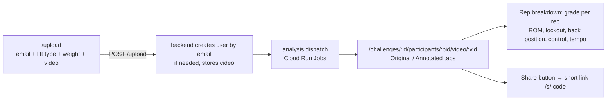
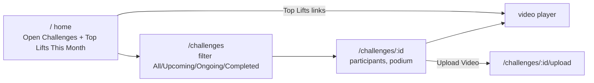
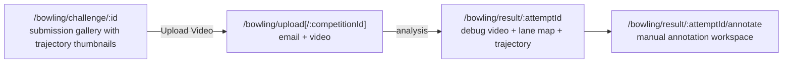
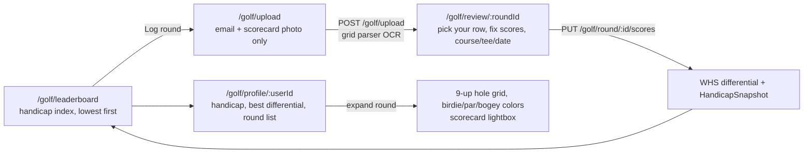
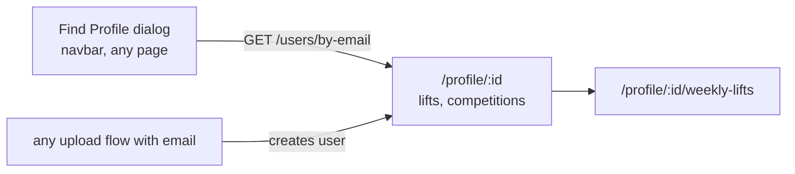

# Tom's Gym — Site Walk & Workflow Map

Captured 2026-07-06 against production (`https://my-frontend-quyiiugyoq-ue.a.run.app`, frontend build `v2026-07-06 02:08 UTC`). Screenshots live in [`screenshots/`](screenshots/); each section links the pages it covers.

## Global Navigation

Every page shares the same navbar and footer:

- **Navbar:** Home `/` · About `/about` · Challenges `/challenges` · Leaderboard `/leaderboard` · Golf `/golf/leaderboard` · Feedback `/feedback` · Store `/store` · **Find Profile** (dialog, email lookup)
- **Footer:** Terms (`#` stub) · Privacy (`#` stub) · Feedback · frontend build stamp (`v2026-07-06 02:08 UTC`)

## Route Table (from `frontend/src/routes/index.tsx`)

| Route | Component | Captured |
|---|---|---|
| `/` | Index | [01](screenshots/01-home.jpeg) |
| `/challenges` | Challenges | [02](screenshots/02-challenges.jpeg) |
| `/challenges/:id` | ChallengeDetail | [03](screenshots/03-challenge-detail.jpeg) |
| `/challenges/:id/videos` | ChallengeVideos | — |
| `/challenges/:id/upload`, `/upload` | UploadVideo | [06](screenshots/06-upload-video.jpeg) |
| `/challenges/:id/participants/:pid/video/:vid` | VideoPlayer | [04](screenshots/04-video-player.jpeg) |
| `/video-player/:id/:pid/:vid` | VideoPlayerRedirect | — (legacy redirect) |
| `/s/:code` | ShortLinkRedirect | — |
| `/athletes` | Athletes | [21](screenshots/21-athletes.jpeg) |
| `/about` | About | [18](screenshots/18-about.jpeg) |
| `/leaderboard` | Leaderboard | [05](screenshots/05-leaderboard.jpeg) |
| `/store` | Store | [17](screenshots/17-store.jpeg) |
| `/profile`, `/profile/:id` | Profile | [20](screenshots/20-user-profile.jpeg) |
| `/profile/:id/weekly-lifts` | WeeklyLifts | — |
| `/auth/callback`, `/auth/error` | AuthCallback / AuthError | — |
| `/bowling/upload[/:competitionId]` | BowlingUpload | [09](screenshots/09-bowling-upload.jpeg) |
| `/bowling/result/:attemptId` | BowlingResult | [08](screenshots/08-bowling-result.jpeg) |
| `/bowling/result/:attemptId/annotate` | AnnotationWorkspace | [10](screenshots/10-bowling-annotate.jpeg) |
| `/bowling/challenge/:id` | BowlingChallenge | [07](screenshots/07-bowling-challenge.jpeg) |
| `/golf/upload` | GolfUpload | [12](screenshots/12-golf-upload.jpeg) |
| `/golf/review/:roundId` | GolfReview | — (only reachable right after an upload) |
| `/golf/round/:roundId` | GolfRound | — |
| `/golf/profile[/:userId]` | GolfProfile | [13](screenshots/13-golf-profile.jpeg), [14](screenshots/14-golf-profile-round-expanded.jpeg) |
| `/golf/leaderboard` | GolfLeaderboard | [11](screenshots/11-golf-leaderboard.jpeg) |
| `/feedback` | FileTicket | [15](screenshots/15-feedback-form.jpeg) |
| `/feedback/list` | TicketList | [16](screenshots/16-feedback-list.jpeg) |
| `*` | NotFound | — |

## Workflows

### 1. Lifting upload → analysis → video player

- Upload is **passwordless**: the email field says "No account needed! Your video will be linked to this email." ([06](screenshots/06-upload-video.jpeg))
- The player page ([04](screenshots/04-video-player.jpeg)) shows an Original/Annotated toggle, weight + Approved badge, an overall letter grade with confidence (e.g. "D — 2 reps detected, 54%"), and a per-rep metric breakdown with pass thresholds.
- Videos without analysis results 404 on `GET /lifting/result/:videoId` — the player quietly hides the analysis panel.

### 2. Challenges (lifting competitions)

- Home ([01](screenshots/01-home.jpeg)) doubles as the challenge hub: hero carousel, challenge cards, "How It Works" (Register → Record → Compete), and "Top Lifts This Month" grouped by lift (Squat / Deadlift / Bicep Curl / Snatch) linking straight into the player.
- ⚠️ Observed: the completed powerlifting challenge detail ([03](screenshots/03-challenge-detail.jpeg)) shows "3 uploaded today · 3 joined" but the podium section says "No entries yet" — likely a data/judging-state mismatch worth a look.

### 3. Bowling upload → ball-tracking result → annotation

- The challenge page ([07](screenshots/07-bowling-challenge.jpeg)) lists submissions with detection quality ("Board: 28", "48.7% detected") — each links to its result page.
- The result page ([08](screenshots/08-bowling-result.jpeg)) is the analysis showcase: annotated debug video (frame counts, tracking method, speed, active lane), a top-down lane/pins board map with the entry board, and a trajectory overlay.
- Low-detection attempts still render ("1.1% detected", "No trajectory") — the annotation workspace ([10](screenshots/10-bowling-annotate.jpeg)) exists to hand-correct these.

### 4. Golf: scorecard photo → OCR review → handicap

- Upload ([12](screenshots/12-golf-upload.jpeg)) is deliberately minimal: email + photo ("Snap your scorecard — scores, pars, and tee ratings are read straight off the photo"), with library upload or camera capture.
- Multi-player cards auto-create guest users (deterministic `<name>@guest.tomsgym.local`), which is why the leaderboard ([11](screenshots/11-golf-leaderboard.jpeg)) shows Chris (21.0) and Paul (25.0) alongside Tom (22.3).
- Profile ([13](screenshots/13-golf-profile.jpeg)) shows handicap / best differential / last round; each round expands in place ([14](screenshots/14-golf-profile-round-expanded.jpeg)) to a color-coded hole grid with bogey/double counts.
- `/golf/review/:roundId` wasn't captured — it's only reachable immediately after an upload (rounds here are all confirmed).

### 5. Identity: passwordless-first

- No login wall anywhere on the walk. Identity is an email typed at upload time; **Find Profile** ([19](screenshots/19-find-profile-dialog.jpeg)) recovers it later. Authenticated (password/Google) accounts exist but are optional.
- Profile ([20](screenshots/20-user-profile.jpeg)) shows the user's videos and competitions; localStorage `userId` keeps the session.

### 6. Feedback / tickets

- `/feedback` ([15](screenshots/15-feedback-form.jpeg)): bug/feature form, auto-attaches localStorage `userId` + referrer page URL, optional email.
- `/feedback/list` ([16](screenshots/16-feedback-list.jpeg)): public triage list with status tabs (open / in progress / closed) and inline status select.

### 7. Static / secondary pages

- **Leaderboard** `/leaderboard` ([05](screenshots/05-leaderboard.jpeg)) — global lifting leaderboard.
- **Athletes** `/athletes` ([21](screenshots/21-athletes.jpeg)) — athlete directory (not linked from navbar).
- **Store** `/store` ([17](screenshots/17-store.jpeg)) — merch grid, no checkout wired to a real payment flow.
- **About** `/about` ([18](screenshots/18-about.jpeg)) — mission, how-it-works, team.

## Observations from the walk

1. **Challenge podium mismatch** — `/challenges/d130cc3c…` reports 3 participants/uploads but renders "No entries yet. Be the first on the podium!" (see [03](screenshots/03-challenge-detail.jpeg)).
2. **Expected 404 noise** — the challenge/player pages probe `GET /lifting/result/:videoId` for every video and 404 on unanalyzed ones; harmless but pollutes the console.
3. **Footer Terms/Privacy are `#` stubs.**
4. **Athletes page is orphaned** — reachable only by URL, not from any nav link seen on the walk.
