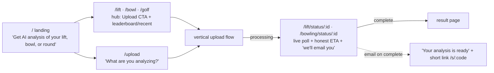
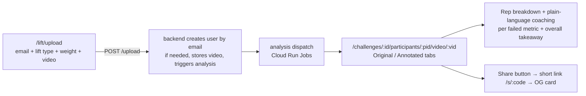
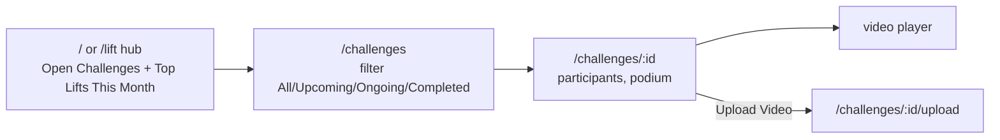
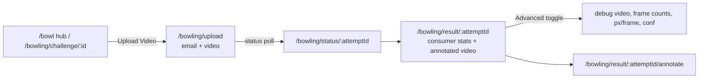
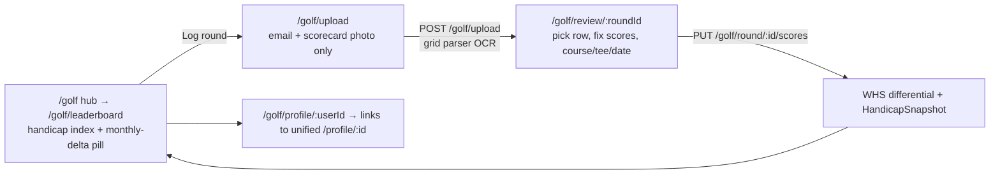
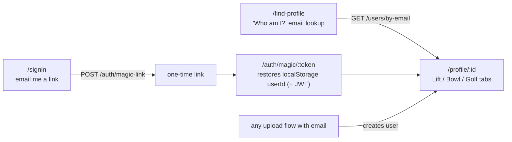

# Tom's Gym — Site Walk & Workflow Map

Captured 2026-07-06 against production (`https://my-frontend-quyiiugyoq-ue.a.run.app`, frontend build `v2026-07-06 16:14 UTC`) — **after the UX roadmap shipped** (T1–T16, see `docs/plans/2026-07-06-ux-roadmap.md` and the "UX Roadmap (shipped 2026-07-06)" section of `CLAUDE.md`). Screenshots live in [`screenshots/`](screenshots/); each section links the pages it covers. Earlier revisions of this doc describe the pre-roadmap site — the observations at the bottom that drove the roadmap are now resolved.

## Global Navigation

Every page shares the same navbar and footer:

- **Navbar:** Home `/` · **Lift** `/lift` · **Bowl** `/bowl` · **Golf** `/golf` · Challenges `/challenges` · Feedback `/feedback` · Store `/store` · **Find Profile** (→ full-page `/find-profile`). The three analysis verticals are now top-level hubs; the old bare "Golf → leaderboard" and standalone "Leaderboard" items were folded into the hubs.
- **Footer:** **Terms** (`/terms`) · **Privacy** (`/privacy`) · Feedback · frontend build stamp (`v2026-07-06 16:14 UTC`). Terms/Privacy are now real pages, not `#` stubs.

## Route Table (from `frontend/src/routes/index.tsx`)

| Route | Component | Captured |
|---|---|---|
| `/` | Index (analysis-first landing) | [01](screenshots/01-home.jpeg) |
| `/lift` · `/bowl` · `/golf` | LiftHub / BowlHub / GolfHub | [24](screenshots/24-lift-hub.jpeg) · [25](screenshots/25-bowl-hub.jpeg) · [26](screenshots/26-golf-hub.jpeg) |
| `/upload` | UploadChooser ("What are you analyzing?") | [27](screenshots/27-upload-chooser.jpeg) |
| `/lift/upload` (`/upload/lift` → redirect) | UploadVideo | [06](screenshots/06-upload-video.jpeg) |
| `/lift/status/:attemptId` · `/bowling/status/:attemptId` | AnalysisStatus (poll + ETA) | — (live only during processing) |
| `/challenges` | Challenges | [02](screenshots/02-challenges.jpeg) |
| `/challenges/:id` | ChallengeDetail (podium fixed) | [03](screenshots/03-challenge-detail.jpeg) |
| `/challenges/:id/videos` | ChallengeVideos | — |
| `/challenges/:id/upload` | UploadVideo | [06](screenshots/06-upload-video.jpeg) |
| `/challenges/:id/participants/:pid/video/:vid` | VideoPlayer (coaching copy + share) | [04](screenshots/04-video-player.jpeg) |
| `/video-player/:id/:pid/:vid` | VideoPlayerRedirect | — (legacy redirect) |
| `/s/:code` | ShortLinkRedirect (SPA) / backend OG-meta route | — |
| `/about` | About | [18](screenshots/18-about.jpeg) |
| `/leaderboard` | Leaderboard | [05](screenshots/05-leaderboard.jpeg) |
| `/store` | Store ("coming soon") | [17](screenshots/17-store.jpeg) |
| `/profile` · `/profile/:id` | Profile (unified Lift/Bowl/Golf hub) | [20](screenshots/20-user-profile.jpeg) |
| `/find-profile` | FindProfilePage ("Who am I?") | [19](screenshots/19-find-profile-page.jpeg) |
| `/signin` · `/auth/magic/:token` | SignIn / MagicLink (passwordless) | [28](screenshots/28-signin.jpeg) |
| `/profile/:id/weekly-lifts` | WeeklyLifts | — |
| `/auth/callback` · `/auth/error` | AuthCallback / AuthError | — |
| `/bowling/upload[/:competitionId]` | BowlingUpload | [09](screenshots/09-bowling-upload.jpeg) |
| `/bowling/result/:attemptId` | BowlingResult (consumer-first, debug behind Advanced) | [08](screenshots/08-bowling-result.jpeg) |
| `/bowling/result/:attemptId/annotate` | AnnotationWorkspace | [10](screenshots/10-bowling-annotate.jpeg) |
| `/bowling/challenge/:id` | BowlingChallenge | [07](screenshots/07-bowling-challenge.jpeg) |
| `/golf/upload` | GolfUpload | [12](screenshots/12-golf-upload.jpeg) |
| `/golf/review/:roundId` | GolfReview | — (only right after upload) |
| `/golf/round/:roundId` | GolfRound (share button) | — |
| `/golf/profile[/:userId]` | GolfProfile (links to unified hub) | [13](screenshots/13-golf-profile.jpeg), [14](screenshots/14-golf-profile-round-expanded.jpeg) |
| `/golf/leaderboard` | GolfLeaderboard (monthly-delta pill) | [11](screenshots/11-golf-leaderboard.jpeg) |
| `/feedback` | FileTicket | [15](screenshots/15-feedback-form.jpeg) |
| `/feedback/list` | TicketList | [16](screenshots/16-feedback-list.jpeg) |
| `/terms` · `/privacy` | Terms / Privacy | [29](screenshots/29-terms.jpeg) · [30](screenshots/30-privacy.jpeg) |
| `*` | NotFound | — |

`/athletes` was **removed** (it rendered mock data — deleted with the honest-copy pass).

## Workflows

### 0. First run — pick a vertical, upload, get analysis

- The landing page ([01](screenshots/01-home.jpeg)) now leads with the analysis value prop and three feature cards (Lift / Bowl / Golf) using real annotated-output imagery; challenges are demoted to a lower section.
- Each hub ([24](screenshots/24-lift-hub.jpeg) · [25](screenshots/25-bowl-hub.jpeg) · [26](screenshots/26-golf-hub.jpeg)) leads with an Upload CTA and links the vertical's leaderboard / recent / challenges.
- `/upload` ([27](screenshots/27-upload-chooser.jpeg)) is an IA chooser routing to the three (still separate) upload flows.
- After an upload the user lands on a **status page** (AnalysisStatus) that polls the existing per-attempt result endpoint (404 = queued), shows an honest ETA ("usually ~2 min; long videos up to 10 min"), and survives reload. On completion the backend emails the uploader a short link (skips bot/test users; never blocks completion on SMTP failure).

### 1. Lifting upload → analysis → video player

- Upload is **passwordless**: email only, no account. Lifting upload moved from `/upload` to `/lift/upload` (`/upload` is the chooser).
- The player ([04](screenshots/04-video-player.jpeg)) shows the Original/Annotated toggle, overall grade, and a per-rep metric breakdown — now with a one-sentence coaching takeaway per failed metric (`lib/liftCoaching.ts`) and a Share button.
- Very-low-confidence lifting results (plank `pose_detection_rate < 0.25`, or rep lifts with `total_reps === 0`) surface filming tips + an "Upload Again" CTA.

### 2. Challenges (lifting competitions)

- "Top Lifts This Month" and all leaderboards now **exclude bot/e2e test accounts** (`User.is_test` flag, migration 013).
- The challenge **podium is fixed**: it now renders joined entries even before analysis completes (previously showed "No entries yet" because it required `status='completed'`). Verified on `/challenges/d130cc3c…` — the podium shows its real entrant.
- "How It Works" copy is now honest and passwordless ("No signup — just your email"); fabricated prize pools removed.

### 3. Bowling upload → ball-tracking result → annotation

- The result page ([08](screenshots/08-bowling-result.jpeg)) now leads with **consumer stats** a bowler cares about — entry board, est. speed, hook direction, pocket hit — plus the annotated video. All engineer internals (frame counts, px/frame, conf values) are behind an **"Advanced"** toggle. The Annotate link stays prominent. *(Screenshot [08] may still show the pre-roadmap debug-first layout — re-capture needs a live prod attempt id.)*
- Low-detection attempts (`detection_rate < 0.25`) show filming tips + retry CTA.

### 4. Golf: scorecard photo → OCR review → handicap

- The leaderboard ([11](screenshots/11-golf-leaderboard.jpeg)) now renders a signed ▲/▼ **monthly-delta pill** per row (lower-is-better: negative delta = green improvement; zero/no-data shows nothing).
- Golf profile links to the unified profile hub and vice-versa.

### 5. Identity: passwordless-first

- **Find Profile** is now a full page ([19](screenshots/19-find-profile-page.jpeg)) reachable from the navbar, not a dialog.
- **Magic-link sign-in** ([28](screenshots/28-signin.jpeg)): `/signin` requests an email link (`POST /auth/magic-link`, always 200 — no email enumeration); opening `/auth/magic/:token` restores the session on any device (single-use, 15-min expiry, rate-limited). Reachable from the find-profile page.
- The unified profile ([20](screenshots/20-user-profile.jpeg)) now has **Lift / Bowl / Golf tabs** — one identity across all three sports, cross-linked with the golf profile.

### 6. Feedback / tickets

- `/feedback` ([15](screenshots/15-feedback-form.jpeg)): bug/feature form, auto-attaches localStorage `userId` + referrer, optional email.
- `/feedback/list` ([16](screenshots/16-feedback-list.jpeg)): public triage list with status tabs + inline status select.

### 7. Static / secondary pages

- **Leaderboard** `/leaderboard` ([05](screenshots/05-leaderboard.jpeg)) — global lifting leaderboard (bot-filtered).
- **Store** `/store` ([17](screenshots/17-store.jpeg)) — "coming soon", checkout disabled (no fake payment implied).
- **About** `/about` ([18](screenshots/18-about.jpeg)) — mission + honest passwordless how-it-works.
- **Terms / Privacy** ([29](screenshots/29-terms.jpeg) · [30](screenshots/30-privacy.jpeg)) — real short pages noting stored email, public visibility of uploads, and a deletion contact.

## Roadmap observations — now resolved

The 2026-07-06 UX roadmap closed the issues the original walk surfaced:

1. ✅ **Analysis features hidden** → top-level Lift / Bowl / Golf hubs + `/upload` chooser; analysis-first landing.
2. ✅ **Bot/e2e data in prod** → `is_test` flag excludes them from all public leaderboards.
3. ✅ **Challenge podium mismatch** → podium renders joined entries without requiring completed analysis.
4. ✅ **Dead-end wait after upload** → status pages with ETA + email-on-complete.
5. ✅ **Engineer-speak results** → bowling consumer view (debug behind Advanced), lifting coaching copy, low-confidence filming tips.
6. ✅ **Fragmented identity** → unified `/profile/:id` hub + full-page find-profile + magic-link sign-in.
7. ✅ **Dishonest copy** → no fake prizes, passwordless messaging, real Terms/Privacy, `/athletes` mock page removed.

Remaining follow-ups (tracked in the plan/CLAUDE.md): emailed short-links (T9) use the frontend origin so they don't unfurl yet — point them at the backend `/s/:code`; the old `FindProfile.tsx` dialog is now dead code. The reliability track (T17) is deferred.
