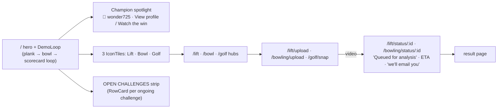
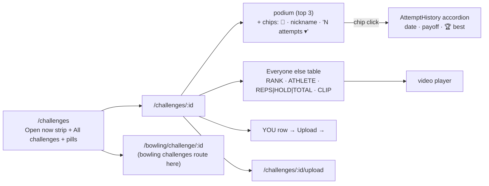
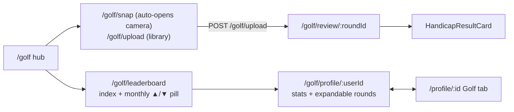

# Tom's Gym — Site Walk & Workflow Map

Captured **2026-08-28** against production (`https://my-frontend-quyiiugyoq-ue.a.run.app`, frontend build `v2026-08-01 22:13 UTC`; `01-home` and `02-challenges` re-captured on `v2026-08-29 02:40 UTC` after the two fixes noted below shipped) with Playwright at 1280×900 (plus three 390×844 mobile shots). Screenshots live in [`screenshots/`](screenshots/); each section links the pages it covers. This supersedes the 2026-07-06 walk — everything shipped since (home redesign, plank stats, lift/attempt history, steadiness nicknames, Challenge Champions, Pushup challenge) is reflected below. Feature internals are in `CLAUDE.md`; this doc is the *what a user sees where* view.

**Re-capturing:** the walk is a `browser_run_code_unsafe` script that `page.goto`s each route, dumps `h1`/buttons/internal links, and `page.screenshot({fullPage:true})`s into `screenshots/`. Dynamic ids (challenges, videos, profiles) are discovered from the links of the static pages, so the script needs no fixtures.

## Global Navigation

Every page shares the same navbar and footer (`components/Layout.tsx`, `Navbar.tsx`):

- **Navbar:** Home `/` · Lift `/lift` · Bowl `/bowl` · Golf `/golf` · Challenges `/challenges` · Feedback `/feedback` · Store `/store` · 🔍 Find Profile `/find-profile`. Collapses to a hamburger on mobile ([22](screenshots/22-mobile-home.jpeg)).
- **Footer:** 🐞 Report a bug · Request a feature (both → `/feedback`) · Terms `/terms` · Privacy `/privacy` · build stamp.
- **Ambient background** (`AmbientBackground`) is mounted once in `Layout`, so every page shares the doodle wallpaper + drifting glows.
- Pages that render *without* the Layout chrome: `/signin` (no nav/footer), the bowling annotation workspace (`/bowling/result/:id/annotate` — full-screen tool), and `/does-not-exist`-style 404s (bare "404" + Home link).

## Route Table (from `frontend/src/routes/index.tsx`)

| Route | Component | What's there | Captured |
|---|---|---|---|
| `/` | Index | hero → DemoLoop → champion spotlight → 3 IconTiles → Open challenges strip | [01](screenshots/01-home.jpeg) · [22 mobile](screenshots/22-mobile-home.jpeg) |
| `/lift` · `/bowl` · `/golf` | LiftHub / BowlHub / GolfHub | primary Upload CTA + RowCard secondary links | [24](screenshots/24-lift-hub.jpeg) · [25](screenshots/25-bowl-hub.jpeg) · [26](screenshots/26-golf-hub.jpeg) |
| `/upload` | UploadChooser | "What are you analyzing?" — same 3 tiles as home | [27](screenshots/27-upload-chooser.jpeg) |
| `/lift/upload` (`/upload/lift` redirects) | UploadVideo | email · lift type (Squat/Bench/Deadlift/Pushup) · weight · video | [06](screenshots/06-upload-video.jpeg) |
| `/lift/status/:attemptId` · `/bowling/status/:attemptId` | AnalysisStatus | "Queued for analysis" poll page; unknown id = queued state | [44](screenshots/44-lift-status-404.jpeg) · [43](screenshots/43-bowling-status-404.jpeg) |
| `/challenges` | Challenges | Create Challenge · "Open now" RowCard strip · All challenges + pill filters | [02](screenshots/02-challenges.jpeg) |
| `/challenges/:id` | ChallengeDetail | podium · chips (👑, nickname, `N attempts ▾`) · "Everyone else" table · YOU row | pushup [03](screenshots/03-challenge-detail-pushup.jpeg) · plank [34](screenshots/34-challenge-detail-a0f2.jpeg) · weight w/ attempts expanded [32](screenshots/32-challenge-detail-plank.jpeg) · [33](screenshots/33-challenge-detail-857f.jpeg) · [47 mobile](screenshots/47-mobile-challenge-pushup.jpeg) |
| `/challenges/:id/videos` | ChallengeVideos | flat grid of every attempt ("Plank - 60.00kg · date · completed") | [35](screenshots/35-challenge-videos.jpeg) |
| `/challenges/:id/upload` | UploadVideo | same form, "Back to Challenge" | [36](screenshots/36-challenge-upload.jpeg) |
| `/challenges/:id/participants/:pid/video/:vid` | VideoPlayer | Original/Annotated · grade · per-lift result body · Share · Re-analyze | plank [04](screenshots/04-video-player.jpeg) · pushup [48](screenshots/48-video-player-pushup.jpeg) · pending [37](screenshots/37-video-player-plank.jpeg) · [23 mobile](screenshots/23-mobile-video-player.jpeg) |
| `/video-player/:id/:pid/:vid` | VideoPlayerRedirect | legacy → route above | — |
| `/s/:code` | ShortLinkRedirect | share-link resolver (backend `/s/<code>` serves OG cards to crawlers) | — |
| `/leaderboard` | Leaderboard | global lifting board, Total/Squat/Bench/Deadlift pills | [05](screenshots/05-leaderboard.jpeg) |
| `/profile` · `/profile/:id` | Profile | header (avatar, 👑 title) · Trophy case · Lift/Bowl/Golf tabs | [20](screenshots/20-user-profile.jpeg) · [38](screenshots/38-user-profile-bowl-tab.jpeg) · [39](screenshots/39-user-profile-golf-tab.jpeg) · no-id [46](screenshots/46-profile-noid.jpeg) |
| `/profile/:id/weekly-lifts` | WeeklyLifts | manual weekly-max tracker + chart (empty for most users) | [40](screenshots/40-weekly-lifts.jpeg) |
| `/find-profile` | FindProfilePage | "Who am I?" email lookup, link to `/signin` | [19](screenshots/19-find-profile-page.jpeg) |
| `/signin` · `/auth/magic/:token` | SignIn / MagicLink | request / consume magic link | [28](screenshots/28-signin.jpeg) |
| `/auth/callback` · `/auth/error` | AuthCallback / AuthError | OAuth remnants | — |
| `/bowling/upload` (`/:competitionId`) | BowlingUpload | email + video | [09](screenshots/09-bowling-upload.jpeg) |
| `/bowling/challenge/:id` | BowlingChallenge | "All Submissions" cards (board, % detected) | [07](screenshots/07-bowling-challenge.jpeg) |
| `/bowling/result/:attemptId` | BowlingResult | Entry Board / Pocket / Speed / Hook · Ball Path · Annotate CTA · Advanced | [08](screenshots/08-bowling-result.jpeg) |
| `/bowling/result/:attemptId/annotate` | AnnotationWorkspace | frame-by-frame ball marking, keyboard-driven | [10](screenshots/10-bowling-annotate.jpeg) |
| `/golf/upload` · `/golf/snap` | GolfUpload (`autoCamera` on snap) | email + scorecard photo ("Upload from library" / "Capture photo") | [12](screenshots/12-golf-upload.jpeg) · [45](screenshots/45-golf-snap.jpeg) |
| `/golf/review/:roundId` | GolfReview | OCR review → confirm → HandicapResultCard | — (needs a fresh upload) |
| `/golf/round/:roundId` | GolfRound | round detail + Share | — (no inbound link on the walked pages; rounds expand inline on the golf profile) |
| `/golf/leaderboard` | GolfLeaderboard | handicap rows + monthly ▲/▼ pill | [11](screenshots/11-golf-leaderboard.jpeg) |
| `/golf/profile/:userId` (`/golf/profile` no-id) | GolfProfile | handicap / best diff / last round · expandable round rows | [13](screenshots/13-golf-profile.jpeg) · [42](screenshots/42-golf-profile-noid.jpeg) |
| `/feedback` · `/feedback/list` | FileTicket / TicketList | bug/feature form · public triage list | [15](screenshots/15-feedback-form.jpeg) · [16](screenshots/16-feedback-list.jpeg) |
| `/store` · `/about` · `/terms` · `/privacy` | static | | [17](screenshots/17-store.jpeg) · [18](screenshots/18-about.jpeg) · [29](screenshots/29-terms.jpeg) · [30](screenshots/30-privacy.jpeg) |
| `*` | NotFound | bare "404" | [31](screenshots/31-not-found.jpeg) |

## Workflows

### 0. Entry — home → vertical → upload → status → result

```mermaid
flowchart LR
    H["/ hero + DemoLoop\n(plank → bowl → scorecard loop)"] --> SP["Champion spotlight\n👑 wonder725 · View profile / Watch the win"]
    H --> T["3 IconTiles: Lift · Bowl · Golf"]
    H --> OC["OPEN CHALLENGES strip\n(RowCard per ongoing challenge)"]
    T --> HUB["/lift · /bowl · /golf hubs"]
    HUB --> UP["/lift/upload · /bowling/upload · /golf/snap"]
    UP -->|video| ST["/lift/status/:id · /bowling/status/:id\n'Queued for analysis' · ETA · 'we'll email you'"]
    ST --> RES[result page]
```

- Home ([01](screenshots/01-home.jpeg)) is the quiet-gym redesign: centered column, no photos. Order top→bottom: hero copy → 12s DemoLoop card with 3 dots → champion spotlight card (gold border) → three IconTiles → "OPEN CHALLENGES" strip → "All challenges →".
- The three home tiles go to the hubs `/lift` · `/bowl` · `/golf` — the same place as the navbar items (until 2026-08-28 they went straight to the upload flows). `/upload` ([27](screenshots/27-upload-chooser.jpeg)) still links straight to the upload pages.
- Hubs ([24](screenshots/24-lift-hub.jpeg)–[26](screenshots/26-golf-hub.jpeg)): one primary CTA + RowCards — Lift: Upload a lift · Leaderboard (+ "Plank challenge" when one is ongoing; none was); Bowl: Upload only; Golf: Snap scorecard · Leaderboard · My golf profile.
- Status page ([44](screenshots/44-lift-status-404.jpeg)) renders the queued state for any id, including unknown ones (404 from the result endpoint = "in line"), so a bad link never errors — it just polls forever.

### 1. Lifting: upload → video player

- Upload ([06](screenshots/06-upload-video.jpeg)): email ("No account needed"), lift type select now includes **Pushup**; weight field hides for Plank/Pushup.
- Player shows a different body per lift type:
  - **Plank** ([04](screenshots/04-video-player.jpeg)): grade · steadiness score + personality badge (e.g. "Jelly — Chaos, but you held on.") · **Steadiness-over-time chart** (state bands Holding/Settling/Lost you, "tap to jump the video") · Holds strip ("3 runs, longest 273s") · stat tiles (total held, form %, longest unbroken, plank style, pose detection, body line).
  - **Pushup** ([48](screenshots/48-video-player-pushup.jpeg)): grade + "39 reps detected" · one **SET BREAKDOWN** card (Depth / Control / Elbow Flare / Body Line / Tempo with avg vs target and ▸ coaching lines) · TIPS. No per-rep table.
  - **Weight lifts** keep per-rep cards; a not-yet-analyzed attempt ([37](screenshots/37-video-player-plank.jpeg), "Toka's snatch · 240 lbs · Pending") shows only an **Analyze Form** CTA.
- Every player: Original/Annotated toggle, Share (short link), Re-analyze, links back to the challenge and to the athlete's `/profile/:id`.

### 2. Challenges

```mermaid
flowchart LR
    CL["/challenges\nOpen now strip + All challenges + pills"] --> CD["/challenges/:id"]
    CD --> POD["podium (top 3)\n+ chips: 👑 · nickname · 'N attempts ▾'"]
    CD --> TBL["Everyone else table\nRANK · ATHLETE · REPS|HOLD|TOTAL · CLIP"]
    CD --> YOU["YOU row → Upload →"]
    POD -->|chip click| AH["AttemptHistory accordion\ndate · payoff · 🏆 best"]
    TBL --> VP[video player]
    CD --> CU["/challenges/:id/upload"]
    CL --> BC["/bowling/challenge/:id\n(bowling challenges route here)"]
```

- `/challenges` ([02](screenshots/02-challenges.jpeg)): "Open now" RowCard strip, then an "All challenges" list of the same RowCards (lift-type pill; trailing Open / Preview / Results by status). Until 2026-08-28 this was an image-card grid with Unsplash placeholder photos. Four lifting challenges + one bowling challenge (`/bowling/challenge/e93c…`) exist in prod.
- Three metrics are live, each with its own column header and payoff format: **REPS** (Pushup challenge `4bd57523…`, ongoing, [03](screenshots/03-challenge-detail-pushup.jpeg)), **HOLD** (Summer plank `a0f27fa4…`, [34](screenshots/34-challenge-detail-a0f2.jpeg)) and **TOTAL** weight ([32](screenshots/32-challenge-detail-plank.jpeg), [33](screenshots/33-challenge-detail-857f.jpeg)).
- Plank boards show **steadiness nicknames** next to names ("💪 The Elusive Steady Eddie", "🌊 One-Shot The Wobbler", "🪼 Human Jellyfish"); ended challenges show 👑 on the winner's podium chip.
- [32](screenshots/32-challenge-detail-plank.jpeg) has the attempt accordion expanded: rows of date · weight · grade pill, 🏆 on the best, and "—" for an unanalyzed attempt.
- `/challenges/:id/videos` ([35](screenshots/35-challenge-videos.jpeg)) is an unpolished legacy grid — every plank card reads "Plank - 60.00kg" (weight shown for a bodyweight lift) — reachable only by URL.

### 3. Bowling

- Bowling challenge ([07](screenshots/07-bowling-challenge.jpeg)) lists submissions with "Board: 28 · 48.7% detected" / "No trajectory" and an Upload Video CTA.
- Result ([08](screenshots/08-bowling-result.jpeg)) leads with Entry Board / Pocket / Ball Speed / Hook tiles (many "—" on low-detection throws), Ball Path, a "Tracking look off?" card → **Annotate Frames**, and an **Advanced** toggle for debug data.
- Annotation workspace ([10](screenshots/10-bowling-annotate.jpeg)) is a bare full-screen tool (no Layout): play/speed controls, frame markers G/B/P/O, keyboard cheat-sheet footer, Save Trajectory.

### 4. Golf

```mermaid
flowchart LR
    GH["/golf hub"] --> GS["/golf/snap (auto-opens camera)\n/golf/upload (library)"]
    GS -->|POST /golf/upload| GR["/golf/review/:roundId"] --> HC[HandicapResultCard]
    GH --> GL["/golf/leaderboard\nindex + monthly ▲/▼ pill"] --> GP["/golf/profile/:userId\nstats + expandable rounds"]
    GP <--> P["/profile/:id Golf tab"]
```

- Upload/snap ([12](screenshots/12-golf-upload.jpeg), [45](screenshots/45-golf-snap.jpeg)) is photo-only: email + "Upload from library" / "Capture photo" / "Analyse scorecard".
- Leaderboard ([11](screenshots/11-golf-leaderboard.jpeg)) has three golfers; profile ([13](screenshots/13-golf-profile.jpeg)) shows Handicap / Best differential / Last round and round rows that expand inline (score, differential, birdie/bogey/double counts). "Full profile" ↔ `/profile/:id`.
- `/golf/profile` without an id and no localStorage user shows "No user ID found. Please upload a round first." ([42](screenshots/42-golf-profile-noid.jpeg)).

### 5. Identity & profile

- `/find-profile` ([19](screenshots/19-find-profile-page.jpeg)) → email lookup → `/profile/:id`; links to `/signin` ([28](screenshots/28-signin.jpeg), magic link, renders without nav).
- Unified profile ([20](screenshots/20-user-profile.jpeg)): avatar · name · "👑 Summer plank challenge Champion 2026" title · email · joined date · **TROPHY CASE** card ("4:35 · won July 31, 2026 · Open →") · Lift (count) / Bowl / Golf tabs. Lift tab = Competition Stats / Personal Bests / Achievements tiles · "Track Weekly Lifts" card (→ `/profile/:id/weekly-lifts`) · **My lifts** history rows (date · type · `m:ss` hold / grade) · Lift Videos gallery · Competition History; Bowl tab ([38](screenshots/38-user-profile-bowl-tab.jpeg)) = bowling results; Golf tab ([39](screenshots/39-user-profile-golf-tab.jpeg)) = handicap + rounds + "Full golf profile →". Avatar picker appears only for the owner (not captured — anonymous walk).
- `/profile` with no localStorage user sticks on "Loading profile..." ([46](screenshots/46-profile-noid.jpeg)) — no redirect to find-profile.
- `/profile/:id/weekly-lifts` ([40](screenshots/40-weekly-lifts.jpeg)) is a manual tracker with an "Add Week" form; empty for every user seen.

### 6. Feedback

- `/feedback` ([15](screenshots/15-feedback-form.jpeg)): Report a bug / Request a feature toggle + title/description/email. Footer's "Request a feature" link lands with **Report a bug** preselected — a user filed a ticket about exactly this (visible in [16](screenshots/16-feedback-list.jpeg)).
- `/feedback/list` ([16](screenshots/16-feedback-list.jpeg)): public, unauthenticated triage with Open / In progress / Closed / All tabs; another filed ticket points out anyone can change statuses.

### 7. Static

Store ([17](screenshots/17-store.jpeg), coming-soon cart), About ([18](screenshots/18-about.jpeg)), Terms ([29](screenshots/29-terms.jpeg)), Privacy ([30](screenshots/30-privacy.jpeg)), 404 ([31](screenshots/31-not-found.jpeg)).

## Observations from this walk

1. ✅ Home tiles vs nav disagreed on where "Lift/Bowl/Golf" goes (tiles → upload, nav → hub). Fixed + deployed 2026-08-28.
2. ✅ `/challenges` "All Challenges" grid used stock photos and a heavy card. Replaced with RowCards + deployed 2026-08-28. Found while doing it: the page's private competition transform never read the lift types (the API only ships them inside the description's JSON tail), so every pill said "Men" — now reuses `transformCompetitionData` from `lib/api.ts`.
3. **Feedback link preselects the wrong type** from the footer's "Request a feature" (user-reported ticket).
4. **`/feedback/list` is public and writable** — anyone can flip statuses (user-reported; known accepted risk in `CLAUDE.md`, but users notice).
5. **Bad status links poll forever** (`/lift/status/<garbage>` shows "Queued") — no "we can't find this attempt" state.
6. **`/profile` without a session hangs on "Loading profile..."** instead of sending users to `/find-profile`.
7. **Video gallery cards say "Plank - 60.00kg"** (a bodyweight lift with the placeholder weight) on `/challenges/:id/videos`, the profile Lift Videos gallery, and Competition History — the list rows already hide it. `/challenges/:id/videos` also has no inbound link — candidate for deletion or a bodyweight-aware label.
8. **Pending weight-lift attempts** render "Pending" with a manual **Analyze Form** button rather than the status page — the older lift flow never got the T8 treatment.
9. Golf: no page links to `/golf/round/:id`; rounds only expand inline on the golf profile. Either wire it (share cards exist for it) or drop the route.
